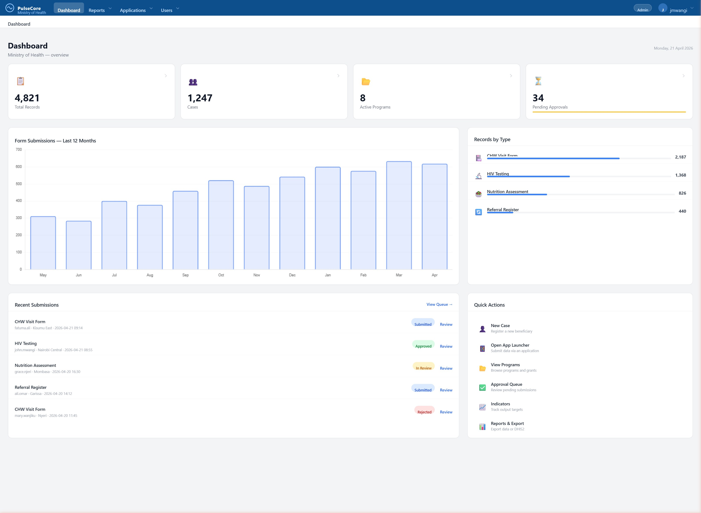
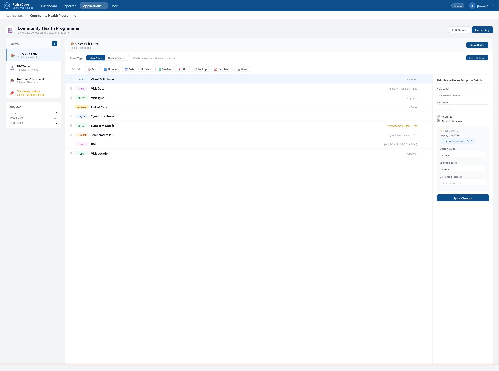

# PulseCore

A multi-tenant data collection and case management platform built for NGOs, health programmes, and field operations. PulseCore consists of two parts:

- **PulseCore Web** — the admin and reporting interface where organisations design forms, manage cases, configure access, and monitor outcomes
- **PulseCore Mobile** *(in development)* — a companion mobile app for field workers that collects data offline and syncs to the server when connectivity is restored

> **Status:** Actively in development. Core features are functional; some modules are still being built out.

---

## Screenshots

### Dashboard


### No-Code App Builder


---

## Features

### App Builder
- No-code form designer with 20+ field types (text, select, date, GPS, lookup, calculated, and more)
- Field-level logic: display conditions, default values, and calculated formulas
- Two form modes: **New Entry** (create records) or **Update Record** (find and update existing data)
- Lookup fields that reference other data types, organisation units, or users

### Data Collection
- Role-scoped record entry — users only see and submit data for their assigned locations
- Organisation unit hierarchy for precise data ownership
- Pre-filled fields based on the user's location and rights
- Inline edit of existing records

### Case Management
- Case registration with consent tracking, demographics, and case numbers
- Programme and grant enrolment per case
- Case-level activity history

### Access Control
- Multi-tenant: each organisation is fully isolated
- Role-based access: Admin, Supervisor, Data Entry, Report Viewer
- Programme-scoped and application-scoped permissions per user
- Org unit visibility rules — users see only their part of the hierarchy

### Reporting & Analytics
- Tabular and summary reports with org unit and date filters
- Excel export
- Indicator tracking and performance monitoring
- Approval workflow queue for submitted data

### Mobile & Offline
- Companion mobile app (in development) for field data collection in areas with no connectivity
- Full offline mode — forms, lookups, and org structure cached on device
- Background sync queue pushes collected data to the server when connection is restored
- Conflict detection when the same record is edited from multiple devices

### API & Integration
- REST API with JWT authentication — powers the mobile client and supports third-party integrations
- All form definitions, org structure, and records are accessible via API
- Rate limiting, caching, and CORS handling built in

### Technical
- SQLite for development; MySQL/PostgreSQL ready for production
- Progressive Web App (PWA) manifest and service worker included

---

## Tech Stack

| Layer | Technology |
|---|---|
| Backend | Python · Flask |
| Database | SQLAlchemy ORM · SQLite (dev) · MySQL/PostgreSQL (prod) |
| Auth | Flask-Login · Flask-JWT-Extended · Flask-Bcrypt |
| Frontend | Jinja2 templates · Tailwind CSS · Vanilla JS |
| PWA | Service Worker · Web App Manifest |
| Export | pandas · openpyxl |
| Email | Flask-Mail · Resend |
| Deployment | Gunicorn · python-dotenv |

---

## Getting Started

### Prerequisites
- Python 3.10+
- pip

### Installation

```bash
git clone https://github.com/Ochanji/PulseCore.git
cd pulsecore

python -m venv venv
source venv/bin/activate        # Windows: venv\Scripts\activate

pip install -r requirements.txt
```

### Configuration

Create a `.env` file in the project root:

```env
SECRET_KEY=your-secret-key-here
DATABASE_URL=sqlite:///instance/pulsecore.db
MAIL_SERVER=smtp.example.com
MAIL_USERNAME=you@example.com
MAIL_PASSWORD=your-mail-password
```

### Run

```bash
python run.py
```

The app will initialise the database, run any pending migrations, and seed default data on first run. Open [http://localhost:5000](http://localhost:5000).

Default admin credentials are created during seeding — check `app/utils/seed.py`.

---

## Project Structure

```
pulsecore/
├── app/
│   ├── models/          # SQLAlchemy models
│   ├── routes/          # Flask blueprints (one per domain)
│   ├── templates/       # Jinja2 HTML templates
│   ├── static/          # CSS, JS, PWA assets
│   ├── utils/           # Helpers: visibility, decorators, seed
│   └── api/             # REST API endpoints (JWT-authenticated)
├── run.py               # Entry point + DB migrations
├── requirements.txt
└── .env                 # Not committed — see Configuration above
```

---

## Architecture

```
┌─────────────────────┐         ┌──────────────────────┐
│   PulseCore Mobile  │◄───────►│   PulseCore Web      │
│   (React Native /   │  REST   │   (Flask + SQLAlchemy)│
│    Flutter)         │  API +  │                      │
│                     │  JWT    │   - Form Builder     │
│   - Offline forms   │         │   - Case Management  │
│   - Local storage   │         │   - Reports & Export │
│   - Background sync │         │   - User & Org Admin │
└─────────────────────┘         └──────────────────────┘
```

## Roadmap

- [ ] Mobile app — offline form collection and background sync
- [ ] Conflict resolution when records are edited from multiple devices
- [ ] Mapping / GIS view for GPS field data
- [ ] SMS and WhatsApp form submission
- [ ] Advanced report builder (pivot, charts)
- [ ] Audit log per record

---

## License

MIT License. See `LICENSE` for details.
